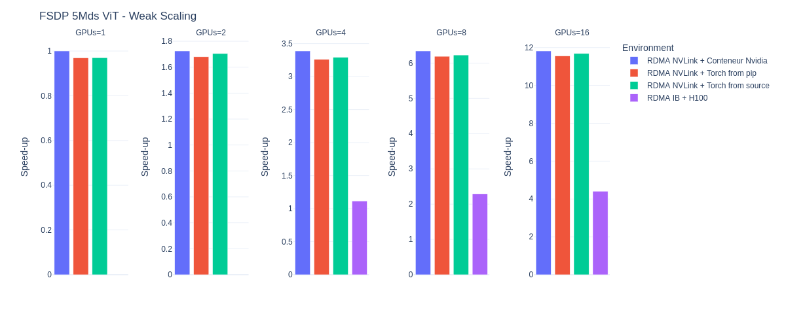
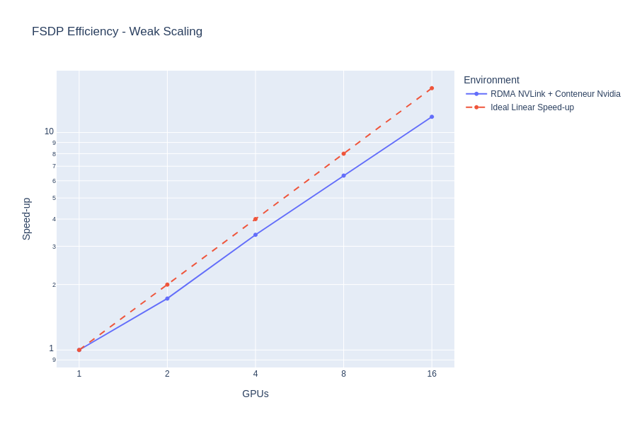
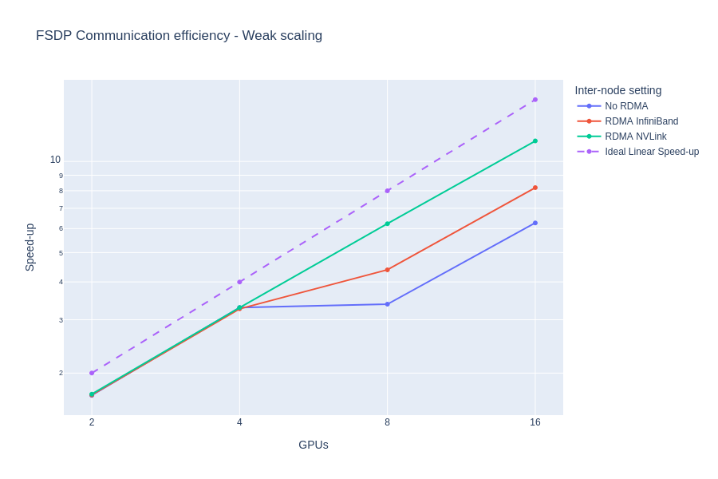

## Clone repository and its submodules
```sh
git clone --recursive https://github.com/MaximeSongIdris/MegaVIT_bench_system.git
```

## Download CIFAR10
```python
from torchvision import datasets
datasets.CIFAR10(root="./data", download=True)
```

## Patch MegaVIT submodule
MegaVIT has a dependency with Poetry, which we want to remove when installing on site-packages.
```sh
mv MegaVIT/pyproject.toml MegaVIT/pyproject_old.toml
cp pyproject_MegaVIT.toml MegaVIT/pyproject.toml
pip install -e ./MegaVIT
```

## Install PyTorch
```sh
pip3 install torch torchvision --index-url https://download.pytorch.org/whl/cu128
```

## Benchmark Results

**Problématique :**  
La solution envisagée pour les environnements logiciels est d’utiliser des conteneurs sur DALIA,  
malheureusement ce n’est pas possible de construire ou modifier des conteneurs directement sur DALIA sans les droits sudo.  
Par ailleurs, construire des conteneurs compatibles avec DALIA nécessite au moins un CPU ARM64.  
Au vu des contraintes, nous cherchons à voir si utiliser des environnements conda paraît plus judicieux.  

Ici on compare directement l’efficacité des environnements conda par rapport à un conteneur optimisé Nvidia.  
2 environnements conda sont proposés : un env qui installe pytorch et ses dépendances directement avec pip comme il est recommandé par Pytorch,  
et un autre qui compile depuis les sources Pytorch pour l’optimiser autant que possible (on optimise cuda, cudnn, nccl et pytorch).  
La référence dans le graphique pour mesurer le speed-up correspond à l’entrainement sur 1x B200 de notre modèle avec le conteneur NVIDIA.  
La différence entre les 3 environnements logiciels est de moins de 5% en temps d’entraînement, ce qui se chiffre ici à quelques secondes de différences par epoch, notamment il n’y a pas de différence entre la compilation depuis les sources et l’usage de pip. 
Par rapport à la meilleure configuration sur Jean-Zay, le speed-up est de x2,65 à x3.  


On fait ici une comparaison par rapport à un scaling parfait où les temps de communications seraient de 0.  
L’efficacité de la FSDP en weak scaling tourne autour de 72% à 84% entre 2 à 16 GPUs.  


La communication d’un GPU à un autre GPU intra-noeud est direct.  
Par contre la communication inter-noeud, sur Dalia, peut soit passer par le réseau InfiniBand, soit via les NVLink directement.  
Lorsqu’elle passe par le réseau InfiniBand, on peut utiliser la RDMA pour ne pas solliciter le CPU.  
Dès 2 noeuds, sans RDMA, les performances systèmes s’écroulent (efficacité autour des 40%).  
Avec la RDMA via le réseau IB, on a une efficacité autour des 50%.  
Finalement, avec l’usage des NVLink, on garde les >70% d’efficacité intra-noeuds (1 à 4 GPUs) en inter-noeuds (> 4GPUs)  

